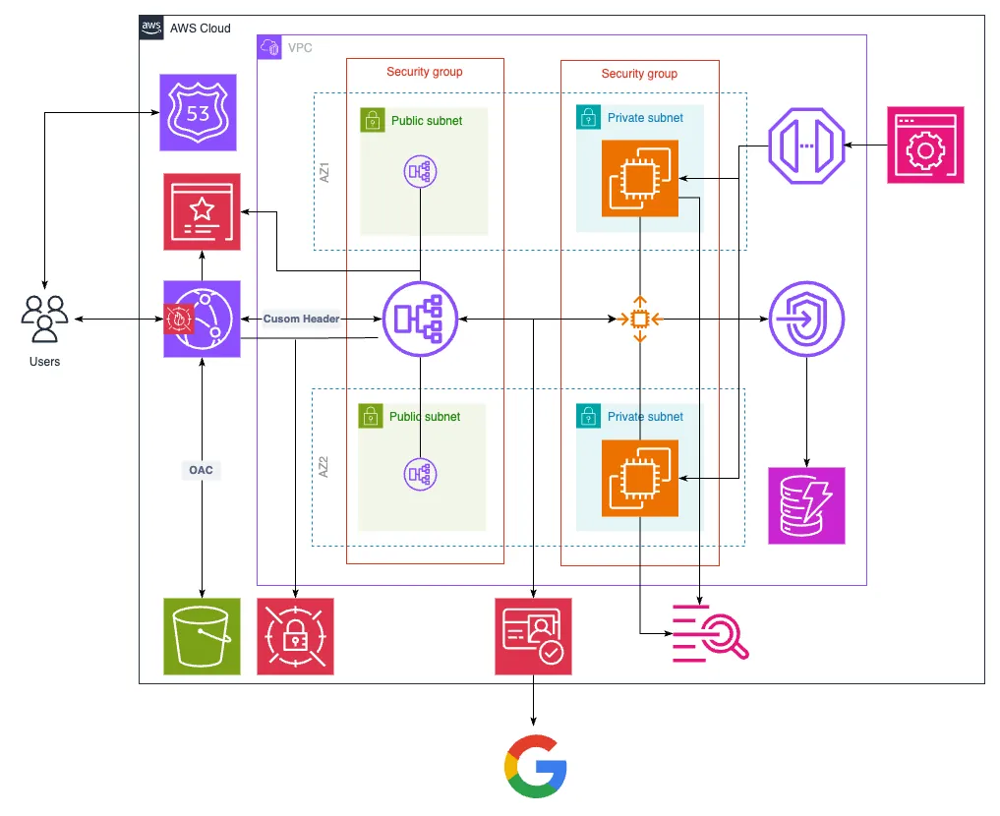

# Frontend on S3, backend on EC2 with CloudFront, ALB and Cognito authentication with google

## Architecture

## Initial Setup

In frontend project, `./packages/frontend`, create two files `.env.local` and `.env.production` with contents as mentioned in the `env.example` file.

## Build and deployment

1. Build frontend: `npm run build -w frontend`
2. Build the cdk project: `npm run build -w ec2`
3. Change into the `ec2` directory: `cd packages/ec2`
4. Build the project: `npm run build`
5. Assume the correct AWS profile.
6. Deploy the stack: `npx cdk deploy --all`
